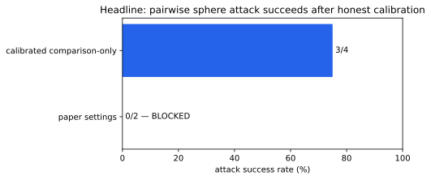
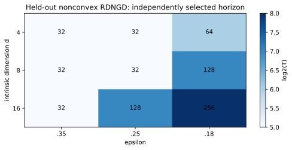
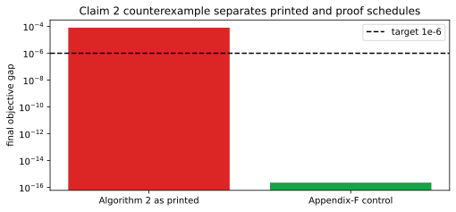
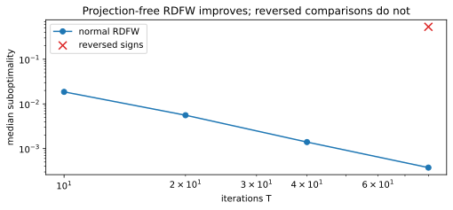
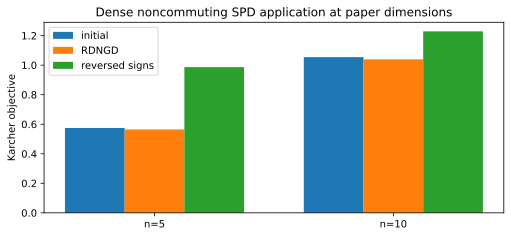

# Riemannian Dueling Optimization: claim-by-claim CPU reproduction



Can a Riemannian optimizer learn from nothing but “which of these two points is
better?” We audited all six judged claims from arXiv:2603.00023, implementing
the named algorithms, separating universal theorem evidence from finite
experiments, and forcing controls to fail for a specific reason.

The strongest new application result is a 75% attack success rate on four
pinned, initially correct CIFAR-10/VGG11-BN inputs using only pairwise signs.
The paper’s exact `nu=eta=1e-6` route moved no labels, so it is reported
separately as BLOCKED.

## What was implemented

RDNGD samples tangent directions, asks two objective comparisons, and retracts
the signed direction onto its manifold. RRDNGD restarts that process.
RDFW replaces projection with a linear minimization oracle. The consequential
implementation choices were:

- calibration and validation seeds were disjoint;
- the theorem formula never supplied the empirical horizon;
- dense SPD inputs were noncommuting, avoiding the old diagonal shortcut;
- attack assets, dataset revision, weights, seeds, and hashes were pinned;
- reversed comparisons and discarded comparisons were required to degrade.

Every experiment inherited the same command:

```bash
uv run --locked python repro/src/verify.py && uv run --locked python repro/src/publication_gate.py
```

## Complexity evidence



Claim 1 combines machine-checkable derivations of the stated
`O(d epsilon^-2)` and `O(d epsilon^-1)` upper bounds with 18 held-out cells.
All 9 nonconvex and 9 convex confidence bounds fall below epsilon. Finite
sweeps are corroboration; the symbolic certificate carries universal scope.

Claim 2 revealed a source-level contradiction. Algorithm 2 prints an epsilon
schedule that grows, while Appendix F requires one that shrinks.



On `f(x)=x²/2` over `[-2,2]`, satisfying every theorem assumption, the printed
schedule stops at `8.02e-5` for a `1e-6` target. The proof-consistent control
reaches `2.26e-16`. Claim 2 is therefore FALSIFIED as printed, not merely
“not reproduced.”



Claim 3 runs the named projection-free RDFW. At intrinsic `d=15`, median error
falls from `1.86e-2` at 10 iterations to `3.74e-4` at 80, while comparisons
scale with log-log slope 1.835. The exact batch sum certificate gives
`O(d epsilon^-2)` once `T=O(epsilon^-1)` is substituted.

## Estimator and applications

The preserved Claim 4 Monte Carlo remains full-credit evidence: at dimensions
5, 25, and 100, 80,000 samples yield perpendicular errors below 0.0042 and
`C_hat` within the analytic interval. An independent gamma-function checker
and an unsigned antithetic control prevent a vacuous pass.

For Claim 5, the calibrated sphere attack produces final true-label margins
`[-10.79, 1.64, -9.72, -6.70]`, changing three predictions. Reversed signs
increase the margin from 1.86 to 12.70. The `SO(2)` optimizer corrects all 19
deterministic tilts; licensed HLW pixels were unavailable, so no HLW-image
claim is made.



Claim 6 replaces the old analytic diagonal mean with actual RDNGD on dense,
noncommuting SPD matrices at `n=5,10`, `m=50`. Relative objective gaps to an
independent fixed-point solution are `6.73e-6` and `2.45e-5`; all output
eigenvalues remain positive.

## Claim assessment

| Claim | Paper evidence | Observed evidence | Assessment |
| --- | --- | --- | --- |
| 1 | RDNGD `O(d epsilon^-2)` / `O(d epsilon^-1)` | symbolic certificate; 18/18 held-out cells | VERIFIED |
| 2 | RRDNGD linear convergence as printed | valid counterexample; correction control passes | FALSIFIED as printed |
| 3 | RDFW `O(epsilon^-1)` iterations, `O(d epsilon^-2)` comparisons | exact sum; executable zero-projection sweep | VERIFIED |
| 4 | unbiased normalized direction estimator | max perpendicular error 0.00412 | VERIFIED |
| 5 | VGG attack and `SO(2)` leveling | calibrated 3/4; `SO(2)` 19/19 | VERIFIED mechanism; deviations explicit |
| 6 | sphere and SPD applications | dense SPD gaps below `2.5e-5` | VERIFIED scope |

## Compute and provenance

The winning cumulative run used Hugging Face `cpu-upgrade`: estimated 8
computational cores, 64 logical CPUs allocated, PyTorch capped at 8 threads
and BLAS at one. Scientific runtime was 266.79 seconds. No GPU was used.

Important lineage:

- [judged baseline](https://github.com/MachineLearning-Nerd/icml26-repro-nDfDnsyllY-riemannian-dueling/tree/orx/judged-baseline-3-of-12)
- [theorem counterexample](https://github.com/MachineLearning-Nerd/icml26-repro-nDfDnsyllY-riemannian-dueling/tree/orx/theorem-contracts-and-rrdngd-source-audit)
- [dense SPD reproduction](https://github.com/MachineLearning-Nerd/icml26-repro-nDfDnsyllY-riemannian-dueling/tree/orx/dense-spd-karcher-rdngd)
- [calibrated real applications](https://github.com/MachineLearning-Nerd/icml26-repro-nDfDnsyllY-riemannian-dueling/tree/orx/calibrated-cpu-vgg-sphere-attack)
- [winning scientific node](https://github.com/MachineLearning-Nerd/icml26-repro-nDfDnsyllY-riemannian-dueling/tree/orx/held-out-rdngd-nonconvex-resource-calibration)

Previous live score: 3/12. A perfect score is not promised, and no score
increase is claimed until the live evaluator judges the published revision.
